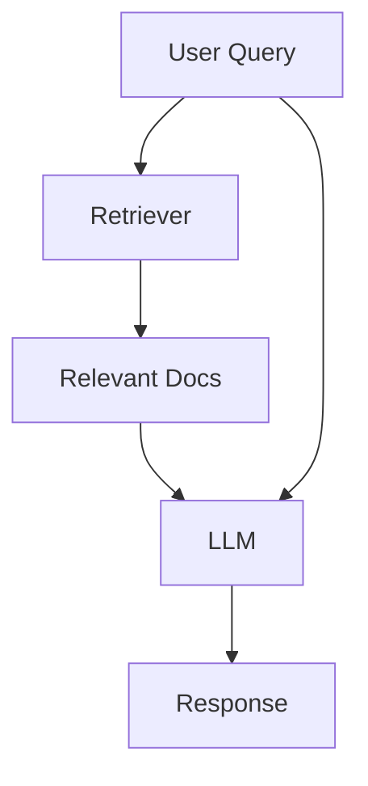
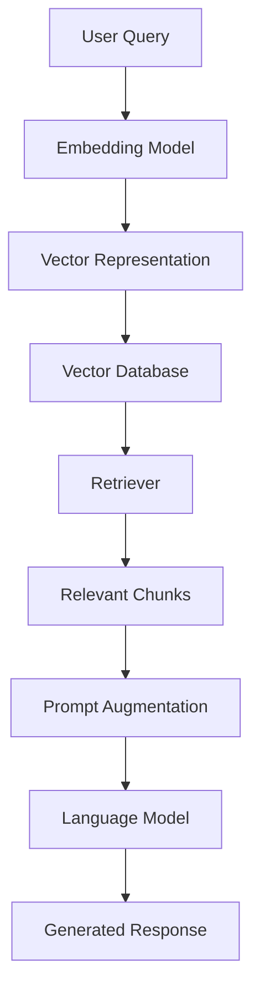

# 📘 Module 1: Introduction to Retrieval-Augmented Generation (RAG)

Welcome to **CompleteRAG** Repository of the RAG !  
In this module, we’ll dive deep into the fundamentals of RAG — a powerful architecture that combines **retrieval** and **generation** to create accurate and context-aware AI systems.

---

## 🔍 What is Retrieval-Augmented Generation?

[**Retrieval-Augmented Generation (RAG)**](https://python.langchain.com/v0.2/docs/tutorials/rag/) is a powerful technique that combines the strengths of **Large Language Models (LLMs)** with **external knowledge sources** to deliver more accurate and context-aware responses.

>  **In simple terms:**  
> Instead of relying solely on what the language model "knows," RAG **retrieves relevant facts from a knowledge base** in real-time to generate accurate, grounded responses.
> [overview of RAG](https://github.com/Adity-star/CompleteRAG/blob/main/all_rag_techniques/01_Introduction/Rag_overview.ipynb)
---

###  Why Do We Need RAG?

LLMs like GPT-4 are trained on massive datasets, but they have some limitations:

-  **Knowledge Cutoff**: Their knowledge is fixed up to a certain date (e.g., April 2023).
-  **No Access to Private Data**: They don’t know your internal documents, company wikis, or databases.
-  **Possible Hallucinations**: Without reliable context, they might make things up.

> **RAG solves this problem by bringing the right information to the model at the right time.**

---

## 🏗️ Architecture of a RAG System

RAG consists of **three main components**:

### 1. 📚 Knowledge Base

This is the source of external knowledge. It can include:

- Text documents (PDFs, Word, Markdown)
- Company wikis and manuals
- Public websites or research papers
- Custom datasets (e.g., customer support logs)

👉 These documents are chunked and stored in a way that makes them easy to search.

---

### 2. 🔍 Retrieval System

Retrieves the most relevant content based on a user's query.

#### Key Parts:
- [**Embedding Model**](https://qdrant.tech/articles/what-are-embeddings/): Converts both queries and documents into high-dimensional vectors (numerical representations of meaning).
- [**Vector Database**](https://www.pinecone.io/learn/vector-database/): Stores and indexes these vectors so similar documents can be found efficiently.

Popular tools:
- Embedding: `OpenAI`, `Hugging Face`, `Instructor`, `BGE`
- Vector DB: `FAISS`, `Chroma`, `Pinecone`, `Weaviate`

📌 Retrieval ensures the model has **relevant, up-to-date context** to work with.

---

### 3. 🤖 Language Model (LLM)

The LLM (e.g., GPT-4, Claude, or an open-source model) takes the original query + retrieved context and generates a final answer.

---
###  How Does RAG Work?

RAG works in two main steps:

1. **Retrieve**: Relevant information is pulled from a knowledge source (e.g., a document store, database, or API) based on the user's query.
2. **Augment & Generate**: The retrieved content is inserted into the prompt, giving the LLM the context it needs to generate a grounded, accurate response.

📌 **In simple terms**:  
Instead of relying only on what it "knows," the model **looks up the answer** and then responds.

### RAG Process Flow

#### Step-by-Step Breakdown
1. User Query: The user submits a question or request.
2. Embedding Model: The query is transformed into a vector representation using an embedding model.
3. Vector Database: The vector is compared against a pre-built index of document embeddings.
4. Retriever: Retrieves the most relevant document chunks based on similarity.
5. Relevant Chunks: The retrieved chunks are selected for contextual relevance.
6. Prompt Augmentation: The original query is combined with the relevant chunks to form an augmented prompt.
7. language Model: The augmented prompt is processed by a language model to generate a response.
8. Generated Response: The final, contextually enriched response is presented to the user.

---
### 📦 Tools That Support RAG

Frameworks like **LangChain** make it easier to build RAG-based applications. With LangChain, you can:

- Build **Q&A systems** that answer based on your documents.
- Set up **retrievers** to pull information from specific sources.
- Use **prompt templates** to insert the retrieved information into the model input.
---

### 🧪 Example Use Case

> **Imagine you have 1,000 customer support documents.**  
> Instead of manually reading them, you ask:  
> *"How do I reset my router?"*  
>  
> ✅ With RAG, the system fetches the most relevant paragraph and feeds it into the model to give a precise, helpful answer.

---

### key Benefits of RAG
- Access external, private, or updated data
- Reduce hallucinations in LLM outputs
- Build search-augmented applications (e.g., chatbots, assistants)
- Supports multi-lingual and multi-modal use cases
- Modular: easy to swap out retrievers, models, or data

  ---
  
### ✅ Summary

| Without RAG                        | With RAG                                   |
|-----------------------------------|--------------------------------------------|
| Limited to training data          | Can use live or private data               |
| Prone to hallucinations           | More accurate and grounded responses       |
| Static knowledge                  | Dynamic, real-time knowledge integration   |

RAG is the key to unlocking **real-time, reliable AI applications** that work with your own data.

---
### Additional Reading
- [LangChain RAG Concepts](https://python.langchain.com/v0.2/docs/concepts/rag/)
- [OpenAI on Embeddings](https://platform.openai.com/docs/guides/embeddings)
- [FAISS by Facebook AI](https://platform.openai.com/docs/guides/embeddings)

