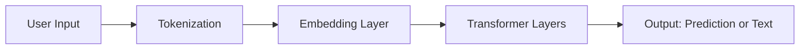

# 📘 Module 2: Understanding Language Models & Knowledge Bases

Welcome to **Module 2** of the **Retrieval-Augmented Generation (RAG)** course!  
In this module, you’ll learn the **core building blocks** of RAG systems:

- 🤖 Large Language Models (LLMs)
- 📚 Knowledge Bases

Understanding these components is essential for developing reliable, real-world RAG applications.

---

## 2.1 🧠 What Are Large Language Models (LLMs)?

**Large Language Models (LLMs)** are deep learning models trained on enormous text datasets. They’re designed to understand, process, and generate human-like language.  

LLMs use the **Transformer** architecture—a breakthrough that allows models to focus on relationships between words regardless of their position in a sentence.

### 2.1.1 🔍 Popular LLMs

#### ✅ GPT-4 (Generative Pretrained Transformer 4)
- **By**: OpenAI  
- **Features**: Multimodal (text + image), creative writing, code synthesis, reasoning.  
- **Used For**: Chatbots, content creation, code generation.

#### ✅ BERT (Bidirectional Encoder Representations from Transformers)
- **By**: Google  
- **Features**: Bidirectional attention, strong sentence-level understanding.  
- **Used For**: Search ranking, Q&A, classification tasks.

---

### 2.2 🔍 How Do LLMs Work?

LLMs are built using a deep learning architecture called **Transformers**. They are pre-trained on massive datasets using an unsupervised approach (learning from large amounts of text without specific labels). The architecture consists of layers of attention mechanisms that allow the model to focus on different parts of the input when generating responses.

#### **Steps in LLM Operation:**

1. **Tokenization**: Input text is broken down into tokens (smaller units, like words or subwords).
2. **Embedding**: Each token is transformed into a vector (numerical representation).
3. **Processing**: Through multiple layers of attention and transformation, the model processes the text to understand context.
4. **Output Generation**: The model generates predictions (e.g., the next word or an entire sentence) based on the processed input.

### 2.3 Limitations of LLMs
While LLMs are powerful, they do have several limitations:
#### 1. Cutoff Date
- LLMs are trained on datasets with a fixed knowledge cutoff. This means they don't have access to information or events that occurred after that training period.
- Example: A model trained in 2021 won’t know about events in 2022 or beyond.
#### 2. Lack of Access to Private Data
- LLMs are generally trained on publicly available datasets. They cannot access private or domain-specific data unless explicitly provided via integration with external systems (e.g., through APIs or RAG setups).
- Example: LLMs may not have specific information about your company’s internal documents unless they are included in the knowledge base.
#### 3. Hallucinations
- LLMs may hallucinate (generate incorrect or fictional information), particularly when they don't have enough context or when the query is ambiguous.
#### 4. Dependence on Quality of Training Data
If the training data contains biases or inaccuracies, the LLM will reflect those flaws in its outputs. This can lead to biased or misleading responses.

| Limitation                | Description                                             | Example                                          |
| ------------------------- | ------------------------------------------------------- | ------------------------------------------------ |
| ❌ Knowledge Cutoff        | LLMs don’t know anything after their training date.     | GPT-4 doesn't know about 2024 events.            |
| 🔒 No Private Data Access | They can’t access internal or personal data by default. | No knowledge of your company's internal docs.    |
| 🎭 Hallucinations         | They may generate plausible but incorrect answers.      | "Einstein was born in Canada" (false).           |
| 🧪 Biased Outputs         | Reflects training data flaws.                           | Toxic or biased language if present in the data. |

---

### 2.4  What Are Knowledge Bases?
In RAG, the Knowledge Base is the system’s external memory. It stores relevant data and can be queried in real time to provide updated or private information.

### 🏛️ Public vs. Private Data
- **Public Data**: This includes datasets, documents, research papers, books, and articles that are publicly available. LLMs trained on this data are able to generate responses based on that general knowledge.
- 
 Examples: Wikipedia, public news articles, publicly available APIs.
- **Private Data**: This refers to domain-specific or proprietary data that is not available to the public. LLMs alone cannot access this information unless it's integrated with a retrieval system.

Examples: Internal documents, customer support logs, proprietary business databases.

### 🌐 Common External Data Sources for RAG
Here are some common external data sources used in RAG systems:
1. Databases
Relational databases (e.g., MySQL, PostgreSQL) or NoSQL databases (e.g., MongoDB) are common sources for storing structured data.

Example Use Case: Retrieving user-specific information for personalized AI responses.

2. APIs
APIs allow RAG systems to retrieve live, real-time information from external services.

Example Use Case: Fetching weather data or stock market prices.

3. File Systems
File-based systems (e.g., PDFs, Word documents, or spreadsheets) can serve as a knowledge base when properly indexed and embedded.

Example Use Case: Retrieving company reports or manuals for customer support.

| Type       | Description                 | Examples                              |
| ---------- | --------------------------- | ------------------------------------- |
| 🌐 Public  | Open, general knowledge     | Wikipedia, news, public APIs          |
| 🔐 Private | Restricted, domain-specific | Company docs, customer logs, CRM data |

---
### 2.5 Integrating Knowledge Bases with LLMs
To build an effective RAG system, integrating the knowledge base with the LLM is essential. The system works by using the retrieval and generation capabilities of the model:

#### Steps in Integration:
1. Preprocessing & Embedding
- Extract and clean knowledge base content.
- Convert text to embeddings (vector representations).
- Store in a vector database like FAISS or Pinecone.

2. Query + Retrieval
- User query is embedded and compared to the stored vectors.
- Top-k relevant documents are retrieved using semantic search.

3. Response Generation
- The retrieved context is combined with the user query.
- Passed to an LLM (e.g., GPT-4) for final response.

#### 2.6 🧰Tools for Integration:
- LangChain: A framework that helps integrate LLMs with external data sources (e.g., databases, file systems).
- FAISS / Pinecone: Vector databases used for efficient retrieval of similar documents based on embeddings.
- OpenAI API / Hugging Face: APIs that allow easy access to LLMs for integration.

| Tool                          | Purpose                                 |
| ----------------------------- | --------------------------------------- |
| **LangChain**                 | Framework for building RAG apps         |
| **FAISS / Pinecone**          | Vector databases for semantic retrieval |
| **OpenAI API / Hugging Face** | Interfaces for LLM access               |
| **ChromaDB / Weaviate**       | Alternative vector stores               |

---
### 2.7 Key Takeaways
- LLMs (like GPT-4 and BERT) are incredibly powerful for generating human-like responses but have limitations like cutoff dates and lack of access to private data.
- Knowledge sources for RAG can come from both public and private data. By combining these sources with LLMs, we can build intelligent systems that provide context-aware, accurate, and up-to-date responses.
- Integrating external knowledge bases with LLMs involves preprocessing data, setting up retrieval systems, and feeding relevant information into the LLM for response generation.
---

 ### 2.8 Further Reading
- [OpenAI GPT-4 Documentation](https://platform.openai.com/docs/guides/text?api-mode=chat)
- [BERT Explained](https://towardsdatascience.com/bert-explained-state-of-the-art-language-model-for-nlp-f24e7da3f36f)
- [Pinecone for Knowledge Retrieval](https://www.pinecone.io/)
- [FAISS - A Library for Efficient Similarity Search](https://github.com/facebookresearch/faiss)

  ---
  ### What's Next?
  In Module 3, we will explore how RAG workflow works with LangChain, and integrate it with an LLM to build an end-to-end RAG pipeline.

➡️ Proceed to Module 3: RAG Workflow
