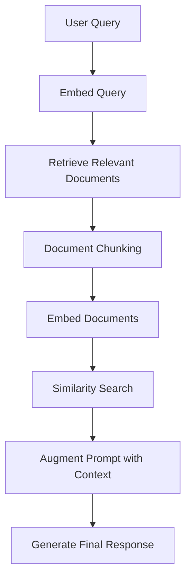

# 📘 Module 3: The RAG Workflow

Welcome to **Module 3** of the **Retrieval-Augmented Generation (RAG)** course!  
In this module, we’ll walk through the **end-to-end workflow** of how RAG operates — from receiving a user query to generating a contextually accurate and grounded response.

---
###  Visual Overview: The RAG Workflow


---
## 🧠 How RAG Works: Step-by-Step Process

A RAG system blends retrieval with generation to overcome the limitations of standard language models.

Here’s the **4-step process** at a glance:
1. Accept a user query.
2. Retrieve relevant documents from a knowledge base.
3. Combine the query with the retrieved content (augment the prompt).
4. Generate a grounded response using a language model.


---
## RAG Workflow Breakdown
The **RAG process** follows a structured sequence that ensures language models generate **grounded**, **accurate**, and **relevant responses** by retrieving information from an external knowledge base and augmenting the language model’s prompt. Let's break it down step by step:

### 1. **User Query**
   - **Description**: The process begins when the user submits a **query** or request. This could be:
     - A **question** (e.g., "What is the capital of France?").
     - A **search prompt** (e.g., "How do I install Python on Windows?").
     - A **task request** (e.g., "Summarize the latest advancements in AI research").
   
   - **Role in RAG**: This input query sets the context for the entire process. It's the foundation upon which external knowledge will be retrieved to answer the user’s request.

### Example User Query
```text
"What are the applications of RAG in healthcare?"
```

### 2. **Embedding Query**
   - **Description**: The query is converted into a **numerical vector representation** using an **embedding model** (e.g., `text-embedding-ada-002` or similar models).
     - **Purpose**: The embedding captures the **semantic meaning** of the query, making it easier to compare and retrieve relevant information from the knowledge base.
     - **Tools**: Common embedding models, such as **OpenAI embeddings** or models from **Hugging Face**, are used to transform the query into a vector that the retrieval system can work with.

   - **Example**: A query like "What is the capital of France?" will be represented as a high-dimensional vector, capturing the core semantic meaning related to concepts like "capital," "France," and "city."
   - ** Role in RAG**:The query embedding serves as the input for the retrieval system, allowing the system to perform a similarity search within the knowledge base. By transforming the query into an embedding, it becomes possible to search for relevant documents in vector space, which leads to more accurate results.

 
---


### 3. **Retrieve Documents**
   - **Description**: The next step involves searching for relevant documents or data that may help answer the query. This could include:
     - **Structured data** (e.g., databases, knowledge graphs).
     - **Unstructured data** (e.g., web pages, articles, research papers).
     - **APIs** or **external sources** (e.g., a company's internal knowledge base).
   
   - **How it Works**: The query's embedding is compared with the embeddings of available documents in a vector database (e.g., FAISS, Pinecone, Chroma) to retrieve the most relevant documents or text chunks.
     - **Example**: If the query is about the capital of France, the retrieval system will search through documents, returning chunks that mention Paris, capital cities, or France.
   - **Role in RAG**: The goal of this step is to find the most relevant documents or information to answer the query. The retrieval system improves the accuracy of the model by providing context that might not be in the model's original training data.
---

### 4. **Document Chunking**
   - **Description**: Once the relevant documents are retrieved, they are often **chunked** into smaller sections (e.g., paragraphs, sentences) to make them easier to process and handle.
     - **Purpose**: Chunking helps maintain context while making the search and indexing process more efficient. It ensures the relevant information is contained within manageable pieces that can be easily injected into the prompt.
   
   - **Example**: If the retrieved document contains several sections, it might be chunked into:
     - Section 1: "Paris is the capital of France..."
     - Section 2: "France is a country in Europe..."
   
   - This step makes it possible to handle large documents without overwhelming the system.
---
### 5. **Embedding Documents**
   - **Description**: After chunking, each of these smaller chunks of text is transformed into vector embeddings using the same embedding model used for the query.
     - **Purpose**: By embedding the document chunks, the system can efficiently store and retrieve them based on their semantic similarity to future queries.
     - **Storage**: These embeddings are stored in a **vector database**, allowing quick lookups for relevant information.

   - **Example**: The chunk “Paris is the capital of France” will be embedded into a vector, stored in the vector database for future retrieval.

---
### 6. **Similarity Search**
   - **Description**: Using the query’s embedding, the system performs a **similarity search** to identify the most relevant document chunks stored in the vector database.
     - **Purpose**: This ensures that the system retrieves only the most relevant and semantically related pieces of information from the knowledge base.
   
   - **How it Works**: A **retriever** (e.g., FAISS, Pinecone) compares the query vector against the stored document vectors and fetches the **top-k** most relevant chunks based on similarity.

   - **Example**: If the query is "What is the capital of France?", the retriever will fetch the chunks mentioning Paris, capital cities, and related concepts.
---
### 7. **Augmenting the Prompt**
   - **Description**: After the relevant documents are retrieved, they are combined with the original user query to form an **augmented prompt**.
     - **Purpose**: This step ensures that the language model has enough context to generate an informed and relevant response based on both the user query and the retrieved information.
   
   - **Structure of the Augmented Prompt**:
     ```
     [Context: Retrieved Documents]

     [Query: User's Question]
     ```

   - **Example**: 
     - **Context**: "Paris is the capital of France."
     - **Query**: "What is the capital of France?"
   
   - This augmented prompt ensures the LLM knows both the question and the related facts to produce an accurate response.

---
### 8. **Generate Response**
   - **Description**: The **augmented prompt** (user query + retrieved context) is fed into the **language model** (e.g., GPT-4, BERT) to generate a response.
     - **Purpose**: The model generates a response that is grounded in the relevant documents retrieved in the earlier steps. It uses the context provided to produce a response that is more **factually accurate** and **domain-specific**.

   - **Example**: Given the augmented prompt about Paris and France’s capital, the LLM would generate an answer like:
     - “The capital of France is Paris.”

---
## 🧭 Flowchart of the RAG Process

Below is a flowchart summarizing the entire **RAG process**:


---
### Summary
- RAG combines retrieval and generation to create context-aware, grounded answers.
- It allows LLMs to answer questions using private, updated, or domain-specific data.
- The 4 key stages are: Query → Retrieve → Augment → Generate.
---
### Next Module
In Module 4, you’ll learn to build your first RAG pipeline using LangChain, integrating a retriever, an LLM, and a vector store.

➡️ Proceed to Module 4: Tools and Libraries for Building RAG Systems
